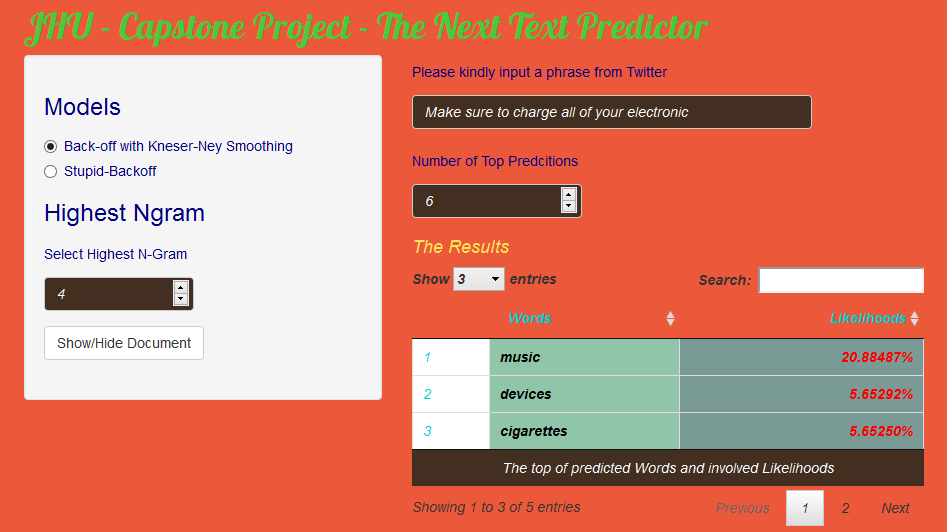

---
title       : The Next Text Predictior
subtitle    : JHU - Data Science Specialization - Capstone Project
author      : Tran Ho Thanh Dong
job         : 
framework   : io2012        # {io2012, html5slides, shower, dzslides, ...}
highlighter : highlight.js  # {highlight.js, prettify, highlight}
hitheme     : tomorrow     # {tomorrow, tomorrow_night, solarized_dark, solarized_light}
widgets     : [mathjax]            # {mathjax, quiz, bootstrap}
mode        : standalone # { selfcontained, draft}
knit        : slidify::knit2slides
--- 

<style type="text/css">

@import url("//fonts.googleapis.com/css?family=Lobster|Cabin:400,700");

slides > slide {
  background: #0477BF !important;
}

.title-slide {
  background-color: #0477BF; /* #EDE0CF; ; #CA9F9D*/
}

.title-slide hgroup > h1{
 font-family: 'Lobster', cursive; 
 color: #FEE202 ;
}


.title-slide hgroup > h2 {
  font-family: 'Lobster', cursive;
  color: #B81D18 ;  /* ; #EF5150*/
}

article p, article li, article li.build, section p, section li{
  font-family: 'Comic Sans MS','Helvetica', 'Crimson Text', 'Garamond',  'Palatino', sans-serif;
  text-align: justify;
  font-size:22px;
  line-height: 1.5em;
  color: white;
}

slide:not(.segue) h2{
  font-family: 'Lobster', cursive;
  font-size: 52px;
  font-style: normal;
  font-weight: bold;
  text-transform: normal;
  letter-spacing: -2px;
  line-height: 1.2em;
  color: #FEE202;
}


/* Tables */
table caption{
  margin-top: 20pt;
  font-weight: normal;
  font-family: "Trebuchet MS", Garuda, sans-serif;
}

table th {
  text-transform: capitalize;
}

/* Tables */

table {
  border: none;
  width: 100%;
  border-collapse: collapse;
  font-size: 20px;
  line-height: 32px;
  font-family: 'Trebuchet MS';
  font-weight: bolder;
  color: black;#BD0102;
}
table thead {
  border-top: 1px solid #BFBEAD;
  border-bottom: 1px solid #BFBEAD;
}
table td, table caption {
  margin: 0;
  padding: 2pt 6pt;
  text-align: center;
  vertical-align: top;
}
table th {
  background: #191919;
  color: #48ca3b ;
  text-transform: uppercase;
  text-align: center;
  vertical-align: top;
}
table td {
  border-bottom: 1px solid #CFCEBD;
}
table tr:nth-child(2n+1) {
/*  background: #E8F2FF; */
  background: #F9DF8D;
}

table tr:nth-child(2n) {
/*  background: #E8F2FF; */
  background: #EE9C21;
}
</style>


## How Does the App Work?

1. Waiting until the data is loaded and the message "Please input more word" appears
2. Please select the Model and the Highest Ngram used for predicting.
3. Please input number of top predcited words you want to display
4. Please input a phrase from **Twitter** for predicting
5. See the results of top words predicted and involved likelihoods

<div style='text-align: center;'>
    
</div>

--- .class #id

##  The Data Set for Ngram Models


- Due to a limit of capacity deployed on Shiny as well as required to predict Twitter, I used only Twitter file provided by Coursera. 

-  70% of Twitter file is then used to generate 1-Gram, 2-Gram, 3-Gram and 4-Gram models.

-  A Dataset of above-mentioned Ngram models is built and is used for predicting. It is considered the Training Set

- 30% remaining of Twitter file is used as the Test Set

- In fact, in order to evaluate accuracy, I also created datasets of Ngram Models (up to 6-Gram) from Blog and News files for predicting Blog and News. Please kindly see the accuracy slide (slide 5)

- User input is cleaned and processed to creat 1-Gram, 2-Gram, 3-Gram which are searched matching with 2-Gram, 3-Gram and 4-Gram in the Dataset

- The next slide will present how the models use Ngram models for predicting next word


--- .class #id

## The Models

- Model 1 - Backoff and Knesser-Ney Smoothing: search matching from 4-Gram. If no match occurs, backing off to 3-Gram and so on unitl a match occurs. Then, Knesser-Ney Smooth is applied from matching N-Gram to lower N-grams. If no matching till 1-Gram, the model return words "the". The Knesser-Ney Smooth:

$$P_{KN}(w_{i}|w_{i-n+1}^{i-1}) = $$
$$\frac{max(c(w_{i-n+1}^{i-1}-D,0))}{\sum_{w_{i}}{c(w_{i-n+1}^{i-1}})}+\frac{D}{\sum_{w_{i}}{c(w_{i-n+1}^{i-1}})}*N_{1+}(w_{i-n+1}^{i-1 }*)*P_{KN}(w_{i}|w_{i-n+2}^{i-1})$$

- Model 2 - Stupid-Backoff: search matching from 4-Gram. If needed, "backs off" with a discount to lower-order N-grams until a highest score match is found. If no matching till 1-Gram, the model return words "the". Score at each matching N-gram:

$$P(W) = \frac{c(w_{i-n+1}^{i-1})}{\sum_{w_{i}}{c(w_{i-n+1}^{i-1})}}$$ 

--- .class #id

## The Accuracy

- The training set is random 70% of entire Twitter file provided, the accuracy is calculated based on randomly sampling of the test set which is 30% remaining of the data
- The result of fitness test against random samples of held out the test data is the following averaged values

```{r, results="asis", echo=FALSE}

accuracy <-data.frame(Dataset = c("Twitter","","","Blogs","","","News","",""), words = c("1","2","3","1","2","3","1","2","3"), Knesser_Ney = c("19.3 %","27.6 %","31.4 %","21.1 %","29.7 %","33.5 %","21.4 %","28.6 %","34.0 %"), Stupid_Backoff = c("17.6 %","25.4 %","29.5 %","18.1 %","26.2 %","30.5 %","19.4 %","27.4 %","31.9 %"), row.names = NULL, stringsAsFactors = F)

library(xtable)
print(xtable(accuracy), type="html", html.table.attributes='class:table', include.rownames = FALSE)
```
